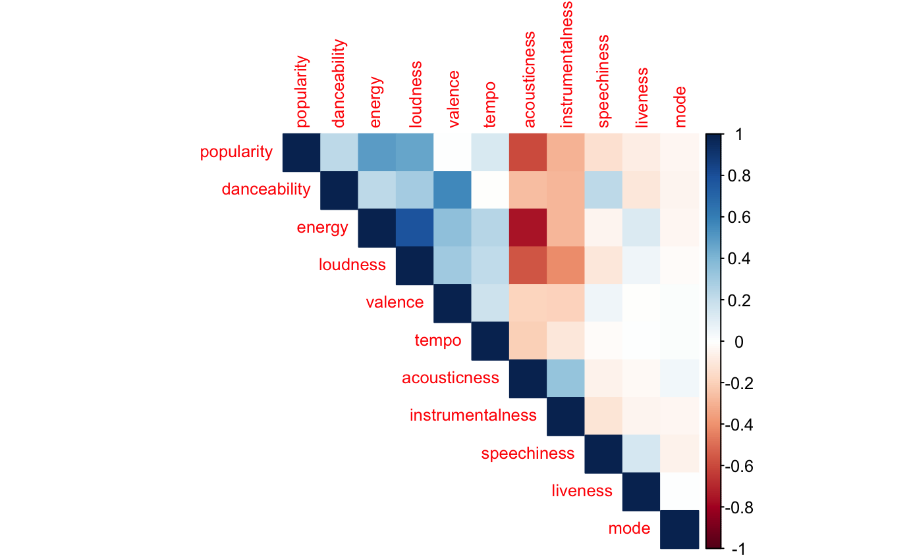

# Spotify Track Popularity Prediction

## Overview
This project investigates the relationship between musical attributes and track popularity on Spotify. Using a dataset of over 160,000 tracks spanning from 1921 to 2020, we analyze which musical features influence popularity and develop predictive models to estimate a song's success based on these attributes.

## Objectives
- Understand how musical attributes such as danceability, energy, and loudness correlate with popularity.
- Develop a predictive model to estimate a song’s popularity using regression techniques.
- Compare different modeling approaches, including Ordinary Least Squares (OLS), robust regression, and Weighted Least Squares (WLS).

## Dataset
The dataset was collected via the Spotify Web API and includes:
- **Track Information:** Name, artist, release year, and duration.
- **Musical Attributes:** Danceability, energy, acousticness, instrumentalness, liveness, loudness, speechiness, tempo, valence, and mode.
- **Popularity Score:** A numerical value (0-100) assigned by Spotify, representing a song’s relative success.

## Methodology
1. **Exploratory Data Analysis (EDA):**
   - Investigated correlations between musical attributes and popularity.
   - Identified potential issues with multicollinearity and non-normality.

   

2. **Regression Models:**
   - **Initial Linear Model (OLS):** Demonstrated significant violations of regression assumptions.
   - **Box-Cox Transformation:** Applied to correct non-normality and heteroscedasticity.
   - **Robust Regression Model:** Mitigated the influence of outliers and improved predictive accuracy.
   - **Weighted Least Squares (WLS):** Explored as an alternative approach but showed minimal improvements.

3. **Prediction Evaluation:**
   - Compared predicted popularity scores with actual values.
   - Observed that the model consistently under-predicted highly popular songs.
   - Identified external factors (marketing, social trends, playlist placements) that impact popularity beyond musical attributes.

   

## Key Findings
- **Danceability, energy, and loudness** positively correlate with popularity.
- **Acousticness, speechiness, and valence** negatively impact popularity.
- **Robust regression** achieved an RMSE of ~4.5, significantly outperforming OLS.
- **The model underestimates extreme popularity values**, highlighting the need for external data sources.
- **The model appears to have a bias towards predicting lower popularity scores**, possibly due to a concentration of lower-popularity tracks in the dataset.
- **Poor predictive performance suggests that simple linear models do not fully capture the factors that determine a track's popularity.**

## Limitations
- The model only considers **musical attributes**, excluding factors like artist popularity, marketing, and playlist placements.
- **Genre-specific trends** and temporal shifts in music consumption were not directly modeled.
- Despite efforts to correct for non-normality and heteroscedasticity, **some regression assumptions remain violated**.

## Future Improvements
- **Integrate external variables** (e.g., artist streaming history, playlist placements, social media trends) to improve predictive accuracy.
- **Train genre-specific models** to better capture differences in how musical attributes impact popularity.
- **Explore machine learning techniques**, such as random forests and neural networks, to model non-linear relationships more effectively.

## Repository Structure
```
├── data/                   # Contains the dataset used for analysis
├── figures/                # Contains visualizations used in the report
├── ReportAndPredictions.Rmd # R Markdown report with analysis and predictions
├── Spotify Report.pdf      # Final report summarizing findings
└── README.md               # Project documentation
```

## Running the Analysis
To reproduce the analysis, follow these steps:
1. Clone this repository.
2. Ensure you have R installed with necessary packages: `tidyverse`, `MASS`, `corrplot`, `rpart`, `rpart.plot`.
3. Run `ReportAndPredictions.Rmd` in RStudio or execute the scripts sequentially.

## Contact
For any questions or collaborations, feel free to reach out to **Luke Feng**.
